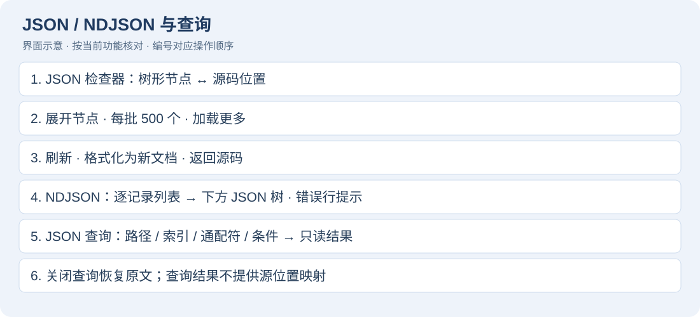
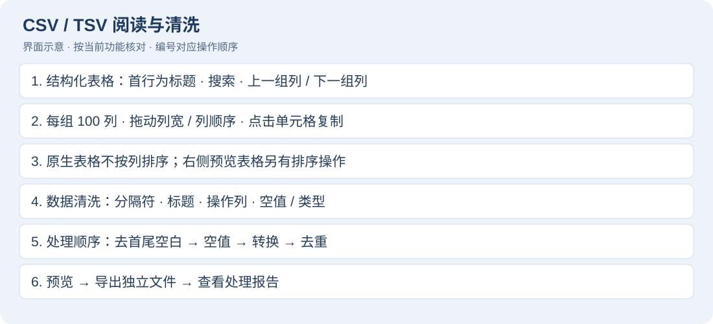
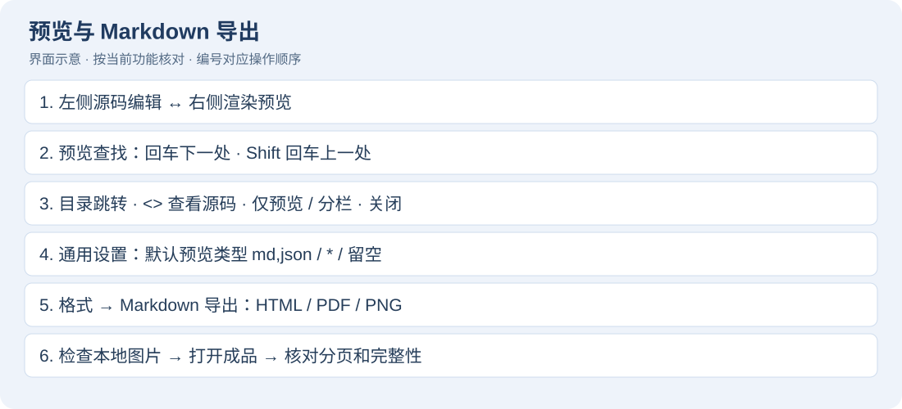
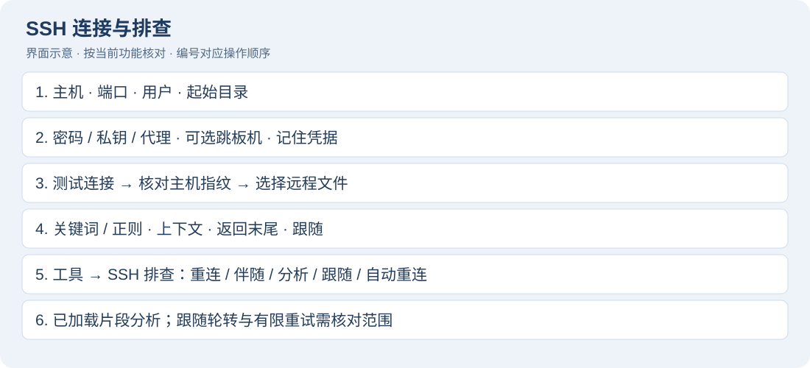
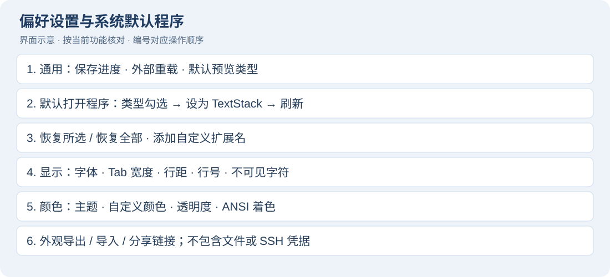

# TextStack 功能使用说明

适用：当前 TextStack 1.18.0 本地构建，macOS 13 或更新版本。核对日期：2026-10-03。菜单名称以简体中文界面为例；英文、日文界面对应功能相同。本手册随应用离线安装，通过「帮助 → TextStack 功能使用说明」打开；顶部搜索框查找词语，回车前往下一处，左侧目录跳转章节。

## 1. 快速开始：五分钟完成一次排查

1. 启动 TextStack，按 ⌘O 打开本地 `.log`、`.txt`、`.json` 或 `.md` 文件，也可以将文件拖到窗口。
2. 在左侧文件列表选择当前文档；多个文件保留在工作区。通过「视图 → 显示 / 隐藏侧栏」腾出阅读空间。
3. 按 ⌘F，输入 `ERROR`。使用下一处 / 上一处移动；选择「筛选匹配行」只看命中记录，使用上下文按钮展开附近内容。
4. 按 ⌘L 输入行号，跳到原始位置；按 ⌘B 标记书签，之后用书签菜单往返。
5. 可编辑文档直接修改，按 ⌘S 保存。新建文档第一次保存选择路径；⇧⌘S 另存为。只读筛选和预览中应回到源码后编辑。
6. 日志用「格式 → 日志时间轴与字段筛选…」分析；Markdown 用「视图 → 预览」阅读，再使用「格式 → Markdown 导出…」输出。


完成标志：能找到错误原始行，保存修改或导出独立排查结果。先复制测试日志体验批量功能，再操作工作文件。

## 2. 文件、工作区与保存

### 打开、新建、压缩文件

1. 「文件 → 新建」或 ⌘N 创建文本；「文件 → 打开…」或 ⌘O 支持多选。
2. Finder 中右键选择使用 TextStack 打开；拖放文件也可进入工作区。
3. gzip / zip 文件自动识别和展开；zip 选择要查看的成员。展开后的内容作为文档查看，保存时留意目标路径，不能将普通保存理解为重新打包压缩文件。
4. 「文件 → 打开最近使用的文件」重开历史文件，可清除最近打开记录；关闭文档后用 ⇧⌘T 重开刚关闭的文档。
5. 左侧区分本地文件和服务器，选中文档切换。⌘W 关闭当前文档；「窗口」菜单管理独立工具窗口。

### 安全保存与恢复

1. 修改后查看未保存状态，⌘S 保存当前文档；⇧⌘S 保存到另一路径。
2. 保存编码可在「文件」菜单选择，转换失败时先用字符检查器找出不可表示字符。
3. 恢复已保存版本会丢弃当前修改，先处理确认提示。文件被外部程序改动时，按提示选择重新加载，不要直接覆盖未知外部变更。
4. 应用恢复上次工作区及未保存草稿，但草稿恢复不能代替主动保存或版本备份。退出时处理未保存文档提示。
5. 「文件 → 打印…」适用于可打印文档，可在系统打印对话框输出 PDF；大文件不提供打印。

## 3. 搜索、筛选和替换


本手册的界面示意按当前控件和操作路径绘制，用于对应操作步骤；颜色与布局不作为实际截图。

### 文档内搜索

1. ⌘F 打开搜索栏，输入文本；需要时开启大小写敏感或正则模式。
2. ⌘G / ⇧⌘G 前往下一处 / 上一处；查找全部查看结果，点击结果定位源码。
3. 先选择文本再使用选区搜索，能缩小排查范围。多词 AND 模式用于同时包含多个词的记录，按搜索栏提示输入。
4. 「视图 → 筛选匹配行」打开搜索并启用匹配行筛选。增加 / 减少上下文显示邻近记录，行号仍为原文件行号。
5. 关闭筛选恢复完整视图。筛选视图只读；保存仍针对完整文档，不是把当前可见行另存。

### 三种搜索范围和最近搜索


| 范围选项 | 如何使用 | 不包含的内容 |
| --- | --- | --- |
| 范围：当前文件 | 选中文档再搜索；可开启仅匹配行与上下文 | 其他文档与磁盘目录 |
| 范围：选中文本 | 先在可编辑源码选中一段，再切换范围 | 未选中的文本；此范围关闭行筛选 |
| 范围：所有已打开文件 | 开好多个本地文档再切换，结果带文档名，点击时切换文档 | 尚未打开的目录文件、远程窗格自有筛选 |

1. 通过顶部“查找 / 查找与替换”切换是否显示替换行。
2. `Aa` 开启大小写敏感；`.*` 开启正则。两个开关互相独立。
3. 普通多词搜索以空白分词，同一行同时包含全部词才命中，例如 `ERROR timeout`。要查含空格的完整短语可启用正则并输入 `connection timeout`；使用正则时注意特殊字符需要转义。
4. 搜索栏放大镜的菜单可选最近搜索或清除最近搜索；不要与“文件 → 最近打开”混淆。
5. 所有已打开文件的可见结果合计最多 500 行；跨文档的下一处 / 上一处在这份结果中循环。达到上限时缩小范围再定位，不能把列表长度当作全文命中总量。
6. 选区和所有已打开文件范围关闭“仅匹配行”；回到当前文件范围后再开启。切换范围不会把过滤结果写入文件。

### 上下文、查找全部和正则实例

1. “仅匹配行”开启后，在 `±` 输入 `2` 并确认，显示命中行前后各 2 行；相邻范围合并，不重复显示。
2. 编辑菜单中的“增加上下文 / 减少上下文”对应 ⌥⌘] / ⌥⌘[。上下文最大 100 行，显示保护上限 100 万行。
3. “查找全部”展示结果列表；点击结果回到文档位置。用“收起”隐藏列表，拖动结果区域分隔线调整高度。
4. 例如正则 `traceId=([A-Za-z0-9]+)` 匹配追踪字段；`ERROR|WARN` 匹配两种级别；`^2026-10-03` 查日期开头。无效正则会显示“模式无效”，先修正表达式。
5. 大文件的未保存编辑会暂停依赖原文件的全文搜索和跟随，先保存再搜索；小文件可继续在内存中搜索。


### 替换与修改预览

1. 在可编辑文档的搜索栏展开替换，输入查找内容和替换文本。
2. 先用替换当前验证效果，再用全部替换；正则模式的替换规则按窗口提示操作。
3. 使用「预览修改」查看将要变化的位置，勾选需要的项，再应用；预览最多列出 500 项。
4. 文档发生修改后重新生成预览；只读、结构化或预览模式中替换不可用时，先回到原始文本。
5. ⌘Z 撤销文档编辑，检查结果再保存。

### 保持大小写、逐项勾选和撤销替换

1. 在“替换为”旁开启 `aA`（保持大小写）。例如查找 `foo`、替换为 `bar` 时，`FOO` 对应 `BAR`，`Foo` 对应 `Bar`；混合大小写按实际预览核对。
2. 替换字段留空代表删除命中的文本。“全部替换”会直接作用于当前范围，优先使用“预览修改…”检查删除数量。
3. 预览按文档和行分组，显示修改前后文本。一行有多处命中时，“展开”查看每一处；整行复选框批量选择，展开后的复选框单独选择。
4. “全选 / 全不选”快速调整，按钮显示本次应用的数量。点击“应用选中替换”后文档处于未保存状态，逐个检查再保存。
5. “撤销替换”用于回退刚应用的那批预览；文档在应用后再次变动时旧撤销可能失效，按提示使用文档 ⌘Z 或重新检查。
6. “所有已打开文件”的预览需要所有目标都支持稳定替换；有只读或不支持的文档时先关闭或缩小范围。跨文档预览的修改在工作区内，磁盘目录批量替换则直接写文件并生成备份，两者不同。


### 跨文件搜索与替换


1. 「编辑 → 跨文件搜索与替换…」（⇧⌘F）打开独立窗口，选择根目录。
2. 输入关键词；需要时填写扩展名（例如 `log,txt,json`）、大小写或正则选项。先点击搜索，查看文件、行号和片段。
3. 双击结果打开源文件。填写替换文本，勾选需要替换的命中项；取消不应改动的项。
4. 确认替换数量后执行。已经在工作区打开的文件或搜索后变更的文件会被阻止；先保存、关闭相应文件并重新搜索。
5. 查看完成 / 部分完成报告。替换前保留原始字节备份，目录位于 `~/Library/Application Support/TextStack/ReplacementBackups/`；每次操作独立目录，含清单和原件。需要恢复时按清单找到对应原文件，先关闭文档，再复制备份恢复；当前没有一键撤销整个目录的按钮。

范围：跳过隐藏项、包目录与符号链接；单文件上限 32 MiB，结果最多 5,000 项，读取内容总量上限 128 MiB。达到上限先缩小目录或关键词再搜索。保留原编码、BOM、换行和权限；多文件替换不是跨文件事务，中途失败以报告和备份为准。

## 4. 大文件、日志跟随和时间合并

1. ⌘O 打开大文件，等待索引进度完成；滚动只绘制可见行。10 GB 是项目演示规模，实际耗时取决于磁盘、编码和内容。
2. 全文搜索在后台执行；按行定位、书签和筛选适合大型日志。大文件编辑采用增量结构，但结构化、预览、打印等能力各有范围限制。
3. 「视图 → 跟随文件末尾」（⌥⌘F）观察追加记录，再点击同一项停止。存在未保存修改时本地跟随暂停，保存后恢复。
4. 「文件 → 按时间合并打开…」（⇧⌘O）选取至少两份本地日志，应用分别自动识别各文件的时间格式，生成按时间排列的普通文本结果；结果带来源标签，可按标签回到对应原文件核对。输入总量上限 512 MiB；无时间戳文件内容排在末尾，无时区时间采用本机时区，syslog 年份采用当前年。
5. 「视图 → 自动换行」切换长行显示；ANSI 日志颜色、字体和主题在设置中调整。需要只看某时段时使用下一章的时间范围筛选。

## 5. 日志时间轴、统计与字段筛选


### 时间轴与统计

1. 打开本地日志，选择「格式 → 日志时间轴与字段筛选…」。远程日志在「工具 → SSH 排查 → 分析已加载日志…」打开，范围仅为已加载片段。
2. 选择按分钟 / 小时 / 天分桶，启动分析，查看总行数、匹配行数、级别统计、时间分布和已识别字段。
3. 无时区的日志指定 UTC 偏移；syslog 指定起始年份。自动识别失败时选择手动时间格式。
4. 输入起止时间缩小时段；只填一端也可。时间范围包括两端边界。
5. 双击匹配行回到源文档，结合原文确认异常。导出完整结果会输出全部匹配内容，表格只显示样本。

### 字段识别与精确筛选

1. 日志可包含 JSON、`key=value` 或 `key:value` 字段，常见别名归一为 level、service、thread、traceId 等。
2. 先不填筛选值分析一次，在状态区查看识别出的字段名；然后在“字段”文本框手动输入 `service`，在“等于”文本框输入 `api`，再次点击“分析 / 筛选”。字段与值不是下拉选择框。
3. 当前一次应用一个字段的精确值条件；不是任意布尔查询、聚合 SQL 或多字段查询语言。
4. 日志分析自动让无时间戳堆栈续行跟随前一条匹配记录，不需要勾选。异常的 `at`、`Caused by` 等行随匹配事件保留。无时间戳的开头内容不会作为带时间记录加入筛选结果。
5. 需要单纯按时间导出时，也可打开「格式 → 时间范围筛选…」，预览后导出完整结果。

范围：工具使用打开窗口时的内容快照；源文档修改后请关闭并重开工具。分析表格最多显示 1,000 行，每行片段最多 2,000 字符；完整导出不受表格样本数量限制。时间桶最多 100,000 个，单行解析上限 4 MiB，非 UTF-8 转换上限 64 MiB。时间自动检测采样前 1 MiB / 1,000 行。导出禁止覆盖源文件，输出 UTF-8。

### 时间筛选与日志分析的参数对照

| 参数 | 输入示例 | 说明 |
| --- | --- | --- |
| 字段 / 等于 | `level` / `ERROR` 或 `service` / `api` | 日志分析专有；值精确匹配，值留空不过滤 |
| 开始 / 结束 | `2026-10-03 10:00:00.000` | 可只填一端；结束早于开始会报错 |
| ISO 边界 | `2026-10-03T10:00:00+08:00` | 输入有时区时按其时间解释 |
| 时区 | `+08:00`、`+00:00`、`-05:00` | 用于无时区日志和边界；不是时区名称文本框 |
| 无年份使用 | `2026` | Syslog 等无年份格式，范围 1–9999 |
| 时间格式 | 自动、ISO、Syslog、Apache、Unix 秒 / 毫秒 | 日志与所选格式对应；不是自定义格式字符串 |
| 桶宽 | 每分钟 / 每小时 / 每天 | 日志分析专有；上表用短条表示相对日志量 |
| 保留无时间戳续行 | 勾选或取消 | 仅“时间范围筛选”窗口提供；日志分析自动保留 |

1. 时间范围筛选点击“预览结果”，检查预览、输入 / 输出行数和检测格式。
2. 改条件后旧预览失效，重新生成；“导出完整结果…”按当前规则生成全文，输出到新文件。
3. 日志分析点击“分析 / 筛选”后，上表显示时间、记录数、ERROR / FATAL、WARN、首条源行；双击时间桶跳到该桶第一条源行。
4. 下表展示源行与最多 1,000 条样本；双击样本回到原文。“导出完整筛选日志…”才是完整结果。
5. 改动任一条件或点击“取消”会清掉旧分析并禁用导出，重新分析后才能导出。统计中的级别汇总与时间桶用于观察分布，先核对当前筛选条件再下结论。

### 可以照着做的日志实例

创建本地 `guide.log`，内容如下：

```text
2026-10-03 10:00:00 ERROR service=api traceId=t01 failed
    at Demo.run(Demo.java:12)
2026-10-03 10:01:00 WARN service=api traceId=t02 slow
2026-10-03 10:02:00 INFO service=web traceId=t03 ready
```

1. 打开日志分析，字段填 `service`，等于填 `api`，时区填 `+08:00`，选择“每分钟”，分析。
2. 应看到 api 的两条事件及堆栈续行；上表两个分钟桶，第一桶有错误，第二桶有警告。
3. 改字段为 `level`、值为 `ERROR`，重新分析，应只保留第一条事件及堆栈。
4. 时间筛选改为开始 `2026-10-03 10:01:00`、结束 `2026-10-03 10:02:00`，勾选保留续行，预览应包含后两条事件。
5. 导出到 `guide.filtered.log`，打开对照原文件，原日志保持不变。


## 6. JSON、NDJSON 与 JSON 查询



1. 打开 `.json`，通过「视图 → JSON 结构检查器…」进入源码旁的原生树视图；也可使用「视图 → 结构化视图 → JSON」。
2. 展开对象 / 数组，选择节点定位源码；大量子节点按每页 500 个分页。
3. 「工具 → JSON 格式化为新文档…」生成新的格式化文档，保留键顺序、重复键和数字原始写法。检查后另存为。
4. 大文件存在待提交修改时先保存再解析；大 UTF-8 文件可使用映射和流式格式化，不要求全文装入文本控件。
5. NDJSON 使用结构化视图中的 NDJSON 模式，逐条选择记录查看 JSON 树。“格式化”按钮（作用于全部记录）将记录输出为独立 JSON 数组文件；错误记录提示序号，遇错停止导出并清理部分结果。
6. 「视图 → JSON 查询」（⌥⌘J）打开当前窗格支持的查询面板，输入表达式后实时更新只读查询结果，回车也可执行；关闭查询栏或再次执行菜单返回原文。查询结果不是带原始行定位的树。不支持的窗格会禁用菜单。

查询示例：对于 `{"items":[{"name":"api","age":30},{"name":"web","age":20}]}`，先尝试下列表达式。

| 表达式 | 用途 / 结果 |
| --- | --- |
| `items[0].name` | 第一条名称：api |
| `items[-1].name` | 最后一条名称：web |
| `items[*].name` | 名称数组：api、web |
| `items[?age >= 30].name` | 筛选年龄后投影名称：api |
| `@` | 整个文档 |

支持字段路径、数组下标、通配投影和比较筛选；不支持管道、函数、数组切片、扁平化或多重选择。遇到表达式错误先用简单路径确认数据结构。

原生检查器与「视图 → 预览」中的 Web 树是两个入口：前者用于解析与源码定位，后者用于多格式阅读。修改源文档后刷新检查器，避免用旧树位置判断新内容。

### 检查器的刷新、错误与分页

1. 原生 JSON 树显示字段、类型和内容；点击节点定位对应源码字节。树中的“加载更多”样式项用于继续加载下一组子节点，不是数据本身。
2. “刷新”重新解析当前来源，“返回原始”关闭检查器。编辑时树可能暂时不可用，等待解析完成或手动刷新。
3. 格式化生成新文档，不在原文上直接重写；新文档需要自行保存为正式文件。解析错误先看状态提示，修复源码再刷新。
4. NDJSON 一行应是一条 JSON 记录。选择记录后，下方 JSON 树检查这条记录；长记录、坏 JSON 或截断内容按错误提示修正。转换全部记录时不会只导出当前筛选可见记录。
5. 原生检查器可复制下方内容；复制或查询不能自动修复 JSON 类型、重复键或业务含义。


## 7. CSV / TSV 阅读、固定宽度与数据清洗



### 表格阅读

1. 打开文件，从「视图 → 结构化视图」选择 CSV 或 TSV。
2. 确认首行是否为表头；过滤记录、调整列宽、重排列，选择单元格查看详情。
3. 支持引号内分隔符、转义引号和多行字段；宽表按每组 100 列分页。
4. 固定宽度记录使用结构化视图中的固定宽度模式，再配合「视图 → 列标尺」和「列字段…」定义边界。
5. 「格式 → 对齐到列参考线」用于可编辑文本；清除列边界或重置浮动面板位置可恢复布局。

### 数据清洗与导出

1. 「格式 → CSV / TSV 数据清洗…」打开窗口，选择分隔符与表头。
2. 填写处理列号（从 1 开始）；留空作用于所有列，表头不参与处理。
3. 选择去空白、填充空值 / 删除含空值记录、转换整数 / 十进制 / 布尔值、按指定列去重等选项。
4. 先生成预览；转换失败查看记录号与列号，再调整规则。去重保留第一条。
5. 「导出完整结果」选择新路径，保存并打开输出文件。可取消长操作；禁止覆盖源文件。

预览最多 64 KiB，完整输出 UTF-8；去重键有 128 MiB / 100 万条保护上限。非 UTF-8 文件转换上限 64 MiB。窗口按打开时快照处理，改过源码后请重新打开工具。

### 原生表格与预览表格的区别

| 项目 | 原生 CSV / TSV 检查器 | 右侧 Web 预览表格 |
| --- | --- | --- |
| 打开 | 结构化视图 → CSV / TSV | 视图 → 预览 |
| 表头 | “首条记录作为表头”可切换 | 由预览渲染规则决定 |
| 过滤 | “搜索记录，回车筛选”，不区分大小写的包含匹配 | 表格自己的文本过滤 |
| 列宽 / 顺序 | 拖列边界调整宽度，拖列头重排 | 调整列宽；点击列头排序 |
| 宽表 | 上一组列 / 下一组列，每组 100 列 | 受预览列数保护限制 |
| 单元格 | 点击后下方详情可选择复制，超长字段最多预览 1 MiB | 阅读预览中的内容 |
| 写回源 CSV | 不会因过滤或重排列写回 | 不会因预览排序写回 |

“返回原始”回源码；源码有改动时刷新检查器。原生记录过滤不会执行正则或 JSON 查询。

### 清洗实例与规则顺序

创建 `guide.csv`：

```csv
id,name,enabled
1, Alice ,yes
1,Alice,yes
2, Bob ,no
3,,yes
```

1. 打开清洗窗口，选择 CSV，勾选首条记录作为表头；所选列填 `2`，开启去除首尾空白。
2. 空值处理选“填充指定值”，填充值为 `Unknown`，类型转换保留文本；去重列填 `1` 并开启去重。
3. 点击“预览结果”。应保留 id=1 的第一条、清理 Alice / Bob 两侧空白，id=3 的姓名变为 Unknown。
4. 如要转换 enabled，单独进行下一轮：列填 `3`、类型选择布尔值，预览后得到 true / false。每轮只有一个所选列组与一种类型转换，不能在同一轮给不同列指定不同类型。
5. 真正执行顺序是去空白 → 空值处理 → 类型转换 → 去重。表头保留；数字转型失败会指出记录、列并中止输出，先修正规则或源值。
6. 去重列留空表示整条记录，不是默认按第 1 列；列号依据输入文件原始顺序，不是检查器里拖动后的显示顺序。


## 8. 预览、Markdown 写作与导出



### 多格式预览

1. 打开文件，选择「视图 → 预览」；Markdown 可按设置自动出现预览。
2. 分栏左侧编辑源码、右侧阅读，滚动按比例双向同步。「视图 → 仅预览 / 显示源码」切换全宽预览与分栏；「视图 → 预览」再次执行关闭预览。需要编辑时切回源码。
3. Markdown 支持 CommonMark / GFM、代码高亮、公式、Mermaid、目录、任务列表与脚注。
4. JSON / YAML 可折叠树；CSV / TSV 可排序和过滤；代码、配置、日志提供高亮；`.mmd` / `.mermaid` 直接显示图表。
5. HTML / SVG 为清理后的结构预览，会移除脚本、样式和外部资源，不能按完整浏览器页面理解。远程图片被阻止，本地图片限定在文档目录。
6. 预览搜索只查已渲染内容，最多高亮 2,000 处；分栏预览主要面向不超过 8 MiB 的文件，达到其他行列 / 字符上限会提示截断。

### 预览工具栏逐项使用


| 控件 | 操作 | 与编辑源码的关系 |
| --- | --- | --- |
| 搜索预览文档 | 输入词语；Enter 下一处、Shift+Enter 上一处 | 只查已渲染内容，不替换文档 |
| 上 / 下箭头 | 在预览命中间移动 | 不等于编辑器 ⌘G 的搜索范围 |
| `<>` 切换源码 | 切换渲染区中的源码显示 | 不等于隐藏左侧编辑器 |
| 目录 | 展开 / 关闭可用目录 | 不支持目录的格式会禁用 |
| 矩形 / 分栏图标 | 隐藏左侧源码，只留预览；再次点显示源码与预览 | 与“视图 → 仅预览 / 显示源码”一致 |
| × | 关闭右侧预览 | 回到源码编辑 |

按 Esc 清空预览搜索。拖动中间分隔线调整源码与预览宽度；如果目录或搜索看起来不完整，检查预览是否已截断。

### 默认预览类型和 Markdown 写作实例

1. 偏好设置 → 通用 → “默认打开右侧预览的文件类型”，填 `md,markdown,json`，之后新打开这些扩展名时自动预览。
2. `*` 表示所有支持预览的类型；留空表示默认不打开。该设置在下一次打开文件生效，当前文档仍用菜单手动切换；它不能把未知格式变成可预览格式。
3. 用下列内容体验标题、表格、任务、公式和图表，再导出 PDF / HTML。

```markdown
# 排查记录
- [x] 已定位错误
- [ ] 待验证修复

| 服务 | 状态 |
| --- | --- |
| api | 恢复 |

公式：$x^2 + y^2 = z^2$

~~~mermaid
graph LR
  A[日志] --> B[筛选] --> C[验证]
~~~
```

4. 图片写成 ``，图片必须能从文档目录范围内读取；先保存 Markdown，再用相对路径组织图片。
5. Mermaid、数学公式和代码语言写法错误时先修改源码，不要把导出问题与源语法错误混为一谈。


### Markdown 导出增强


1. 打开 Markdown 文档，选择「格式 → Markdown 导出…」。
2. 在导出窗口选择浅色 / 深色并确认独立预览；这是打开窗口时的快照，源码改动后重新打开窗口。
3. 输出 HTML：样式、字体及可读取的本地图片随文档嵌入，适合离线分享；脚本与远程网络资源不包含在输出中。
4. 输出 PDF：生成 A4 分页、保留矢量文字，尽量避开普通段落内部切页；超高单块内容仍可能跨页。
5. 输出 PNG：生成完整文档长图，适合插入报告。大尺寸图达到限制时改用 PDF 或缩短文档。
6. 打开导出文件确认公式、图表、图片与分页，再发给他人。

范围：源 Markdown 上限 8 MiB；本地图片单张 20 MiB、累计 64 MiB；PDF 文档高度保护上限 100,000 点；PNG 上限 4,000 × 16,000 像素。失败时按提示缩减图片或内容。

### Finder 快速查看

1. 安装并启动 TextStack，在 macOS 设置的「通用 → 登录项与扩展 → 快速查看」启用对应扩展；某些系统保留旧名称 MrEditor。
2. Finder 选中文件按空格，可重新加载、缩放（50%–250%）、切换源码 / 预览与主题。
3. 齿轮可设置双击预览打开文件，默认关闭。最终提供程序由 Finder 决定，CSV / SVG 可能由系统接管。
4. Quick Look 最多读取 4 MiB，超限显示截断；支持 UTF-8 和带 BOM 的 UTF-16。本地图片还受宿主沙箱限制。

## 9. 比较、合并与草稿恢复


1. 「视图 → 比较」选择两个文件、已打开文档、剪贴板或 HTTPS URL。比较两个文件快捷键 ⇧⌘D。
2. 查看左右行级与字符级差异，用 ⇧⌘[ / ⇧⌘] 跳到上一块 / 下一块。
3. 支持的文本自动进入并排编辑：左侧原文只读，右侧为可编辑结果。点击中间箭头采纳左侧差异，或直接编辑右侧。
4. ⌘Z 撤销；也可使用菜单里的采纳 / 撤销采纳。更大文件使用按差异块合并，具体可用操作由菜单状态指示。
5. 「视图 → 比较 → 将合并结果另存为…」或合并窗格的 ⌘S 保存独立结果；不能覆盖任一原文件。退出前处理未保存结果确认，草稿可恢复。
6. 「比较格式」查看数据形状，快捷键 ⇧⌥⌘F。该模式禁用合并；未修改结果时可切换，准备合并先回到普通比较。

编辑式合并每侧最多 16 MiB / 50,000 行，超过 1 MiB 省略全文语法着色；大文件保留流式按块合并。结果为独立 UTF-8 文件，保留原始换行。URL 比较会访问所输入地址。

### 四种比较入口、侧栏比较与合并实例

1. 比较两个文件：⇧⌘D 选左文件，再选右文件。左侧用于参考，右侧起始内容来自右文件。
2. 比较已打开的文档：从两个列表选择文档；有未保存修改的普通文档采用当前内容快照。也可在侧栏 ⌘点击选中两份文档，右键“比较”。
3. 与剪贴板比较：先复制参考文本，再选中要比较的文档，执行该菜单；剪贴板内容来自操作当时。
4. 与 URL 比较：输入可访问的 HTTPS 地址，下载文本后比较；这是文本比较，不是网页视觉比较。
5. 试例：左文件为 `port=8080`，右文件为 `port=8000`。对比后点中间 `→`，右侧结果改为 8080；⌘Z 撤销，右侧回到 8000。
6. 可直接编辑右侧，比如改为 `port=9000`；两边原文件均保持原状。将结果另存为 `merged.conf` 后再按业务流程使用。
7. “并排编辑”菜单用于可支持的合并状态；支持的文件已自动进入编辑时，不必重复点击。右侧修改后差异高亮与连接带更新，重算期间旧箭头暂时禁用。
8. 大文件无法进入编辑式合并时按差异块应用；“将此差异应用到右侧”对应 ⌥→，“撤销应用”对应 ⌥←。只有当前块可合并时才启用。
9. 比较格式是为了检查形状；修改合并结果后不能随意切换。关闭时保存合并结果或处理确认提示，重开后恢复的草稿仍需核对两边来源。


## 10. SSH 连接、远程读取与排查


### 建立连接

1. 「文件 → 打开远程…」（⌃⌘O），或服务器侧栏 / 首页连接入口。
2. 输入主机、端口、用户名；选择密码、私钥、加密私钥或 SSH Agent。需要跳板机时配置跳板机及其独立认证。
3. 首次连接核对真实主机指纹再确认；密钥变化时连接被拒绝，先与服务器管理员核对，不要盲目信任。
4. 需要保存配置时命名保存；只有选择记住凭据才写入 macOS Keychain。连接使用应用生成的配置，不依赖 `~/.ssh/config`。
5. 浏览远程目录，按文件名过滤 / 修改时间排序，刷新并选中日志打开。

### 连接表单每一项与服务器管理



| 控件 / 字段 | 用法 | 结果 |
| --- | --- | --- |
| 主机、端口、用户名 | 例如 server.example.com、22、deploy | 指定目标服务器 |
| 起始目录 / 路径 | 输入服务器上的绝对路径 | 浏览目录后再选文件；保存配置保存起始目录 |
| 密码 | 选择密码认证，按认证提示输入 | 未选记住时本次会话使用 |
| 私钥文件 | 选择已有私钥，加密私钥按提示输入口令 | 密码与私钥口令不是同一项 |
| SSH Agent | 使用当前可用 Agent | 先确保 Agent 中有相应密钥 |
| 高级设置 / 跳板机 | 开启后填写跳板主机、端口、用户及认证 | 跳板与目标分别认证 |
| 测试连接 | 检查认证、命令能力与起始目录 | 不保存连接配置 |
| 不保存，直接连接 | 临时连接并选文件 | 服务器侧栏可显示临时会话 |
| 保存并连接 | 命名保存，再连接 | 保存服务器配置；凭据是否记住单独决定 |

1. 服务器侧栏点服务器名称连接 / 选择文件；左侧箭头只展开或折叠该组已打开文件。
2. 省略号打开当前服务器编辑器。保存修改只保存配置，不会立即连接；取消放弃修改。
3. “管理服务器”打开完整管理器，可连接、编辑、复制或删除配置。复制后修改名称 / 主机，适合建立相近环境的配置。
4. 删除需要确认，删除的是配置及其已保存凭据，不是远程日志文件；仍在使用的文档先按需要关闭。
5. 更改用户名、认证或主机后不要假设旧会话已切换，按新配置重新连接确认。
6. 目录选择器：文件夹优先，文件默认按修改时间排序；可上一级、修改目录、按文件名过滤、按名称排序与刷新。文件列表最多 10,000 项，缩小目录后重试；压缩文件和特殊文件不能在此打开。
7. “选择其他文件”复用会话，取消选择不会替换当前日志；旧配置保存的是具体文件路径时会迁移到父目录并尽可能预选旧文件。


### 远程排查

1. 阅读按需加载的日志片段；在远程窗格的过滤栏输入关键词，由服务器执行筛选。
2. 选择行按 ⌘C 复制文本。远程窗格只读，不支持直接修改或保存服务器文件。
3. 「工具 → SSH 排查 → 跟随远程日志末尾」追踪追加记录，再次执行停止。
4. 支持 `tail -F` 的服务器自动按文件名跟随轮转，否则退回 `tail -f`；轮转是否可追踪取决于服务器命令能力。
5. 「重连 / 刷新」重新建立读取会话；「中断后自动重连」开启后，跟随失败最多尝试 3 次，间隔 2 / 4 / 6 秒。停止跟随或取消选项会取消等待重连。
6. 「打开独立窗口」把同一日志放进另一阅读窗口，便于并行比较；「分析已加载日志…」分析当前片段，不能代替远程全文扫描。
7. 更换文件可复用连接；关闭远程文档 / 窗口结束对应会话。

菜单只在选中远程文档或远程独立窗口时启用。缺少远程命令时会提示能力限制；远程跟随保留最近约 20,000 行，轮转后行号可能不可用。连接、过滤和跟随需要网络，离线手册无需联网。

### 远程过滤与跟随细节

1. 远程首次显示文件末尾的片段（约 64 KiB），不是从首行加载到末行；后台尝试补足源行号。
2. 过滤框输入 `timeout`，`Aa` 选择是否区分大小写，正则开关按服务器 grep 的语法执行；按回车或“筛选”执行。
3. `±` 填前后上下文，范围 0–100；结果由服务器筛选再传回。服务器正则与本地 Foundation 正则存在差别，复杂表达式先做小范围验证。
4. 清空关键词重新筛选返回日志末尾。一次过滤默认最多 5,000 个匹配事件，再加上下文；显示结果不是无限量远程全文。
5. 发起过滤会停止正在跟随；开始跟随会解除已有匹配行筛选并回到末尾，随后追加新行；跟随期间搜索按钮禁用。
6. 远程来源状态区显示连接 / 过滤 / 跟随状态；重连刷新的是读取会话，不能保证补齐断网期间全部记录。
7. 分析已加载日志对当前显示内容取快照；如需更多上下文，先调整远程过滤或加载范围，再重开分析窗口。


## 11. 多光标、列模式与文本工具

### 多光标与矩形选择

1. 在小文件编辑窗格 ⌘点击添加光标，或 ⌥⌘↑ / ↓ 在上下行添加。
2. 选中文本后 ⌘D 选择下一个相同文本，输入内容同时修改各选区。
3. 「编辑 → 列模式」（⇧⌥⌘C）拖出矩形选区；短行停在行尾。
4. Esc 退出列模式。大文件或只读窗格不提供这组编辑能力。

### 格式菜单与外部命令

1. 选中待处理文本，从「格式」选择大小写转换、URL / Base64 / HTML 编解码、排序、去重、反转、合并行、缩进、行号或拆行。
2. 先选择文本；转换、拆行、编号和外部命令都应在选区上操作，没有有效选区时可能不执行。结果确认后保存。
3. 「视图 → 列标尺」定义列边界；「格式 → 对齐到列参考线」（⌥Tab）用于列文本对齐。
4. 「格式 → 通过命令筛选…」（⌥⌘R）将文本交给本机命令并取回输出，例如使用 `sort`。只执行自己理解的命令；命令的文件和网络行为取决于命令本身。
5. 「编辑 → 剪贴板历史」选择历史项插入当前可编辑位置，清除历史可移除本次运行记录。应用运行时也会采集其他应用复制的文本，历史不持久化。

### 所有文本转换与输出示例

选择文本后，从“格式”执行，⌘Z 可撤销，再保存。

| 功能 | 输入示例 | 输出 / 行为 |
| --- | --- | --- |
| 转为大写 / 小写 | `Abc` | `ABC` / `abc` |
| 单词首字母大写 | `hello world` | `Hello World` |
| 切换大小写 | `AbC` | `aBc` |
| URL 编码 / 解码 | `a b` / `a%20b` | `a%20b` / `a b` |
| Base64 编码 / 解码 | `abc` / `YWJj` | `YWJj` / `abc`，解码内容需是 UTF-8 文本 |
| HTML 编码 / 解码 | `<` / `&lt;` | `&lt;` / `<` |
| 行升序 / 降序排序 | 两行 `b`、`a` | `a`、`b` / `b`、`a`，按文本排序而非数值大小 |
| 删除重复行 | `a`、`b`、`a` | 保留首次出现的 `a`、`b` |
| 反转行顺序 | `a`、`b` | `b`、`a`，不是把行内文字倒写 |
| 合并行 | 多行文字 | 去掉各行首尾空白和空行，以单个空格连接，保留原来的末尾换行 |
| 增加 / 减少缩进 | 选择多行 | 增加一个 Tab；减少一个 Tab 或最多 4 个行首空格 |
| 行编号… | 起始 10、步长 10、零填充 3、分隔符 `: ` | `010: first`、`020: second` |
| 拆分行… | `a, b,,c`，分隔符逗号 | 可去首尾空白、删除空部分，变为多行 |

编号和拆行的分隔符支持 `\t`、`\n` 转义，前次参数会作为下次初值。不合法的编码输入不会得到可靠解码结果，先核对源文本。

### 外部命令完整操作

1. 选中待处理行，执行“通过命令筛选…”（⌥⌘R），输入 `sort`，确认。
2. 应用通过 `/bin/sh` 在本机运行命令，以选区为标准输入，用标准输出替换选区；并不在 SSH 服务器上执行。
3. 使用 `sort -u` 去重排序；已有 `jq` 时可用 `jq .` 格式化 JSON，TextStack 不自动安装命令。
4. 非零退出会展示错误并保留原选区；默认超时 20 秒。运行期间改变选区或切换文档，结果不会覆盖新的选区。
5. 命令可以访问本机文件或网络；先理解命令再执行。只希望查看输出时先复制到临时文档操作。


## 12. 字符与编码检查器


1. 怀疑乱码、不可见字符或编码保存失败时，选中可疑文本；没有选区时检查文档快照。
2. 「格式 → 字符与编码检查器…」打开窗口，选择目标编码。
3. 查看 Unicode 标量统计、LF / CRLF / CR 换行数量、控制字符、零宽字符及双向文字控制符报告。
4. 查看目标编码无法表示的字符及位置，回到源文档修改或改用 UTF-8，再重新检查。
5. 若打开时已乱码，在「文件 → 使用其他编码重新打开」选择正确源编码；保存编码是输出转换，两者作用不同。

最多列出 1,000 个问题位置，检查内容上限 64 MiB。报告不会自动清理字符；合法的制表符、换行和部分不可见字符也可能是业务数据的一部分，按语境判断。

### 五种编码、BOM 与位置的理解

| 选择项 | 常见用途 | 注意事项 |
| --- | --- | --- |
| UTF-8 | 普通源码、日志、Markdown | 能表示广泛 Unicode 字符；检查 BOM 与换行统计 |
| UTF-16 LE / BE | 有字节序要求的文本 | LE 与 BE 是不同字节序，不能任意互换解释原文件 |
| Shift-JIS | 日文旧系统文本 | 某些 Unicode 字符无法表示 |
| EUC-JP | 日文旧系统文本 | 同样需核对目标编码兼容性 |

1. “文件 → 使用其他编码重新打开”处理读取方式；“文件 → 文本编码”设置下一次保存输出编码。看状态栏确认当前来源，不能通过设置输出编码修复已错误解码的文字。
2. 重新打开前先处理未保存修改；改编码后保存或另存为，再重开输出核对。
3. 字符报告按 Unicode 标量检查；一个用户看见的字符可能包含多个标量，所以标量数量不是字数。问题位置也不能直接当作原文件的字节偏移。
4. 零宽、方向控制或行尾空格可能是合法数据。检查器只报告，不执行自动修复；逐处选择源码确认。
5. 换行统计区分 LF / CRLF / CR；编辑插入的换行按文档的原始换行规则归一，混合换行文件应先在副本上验证保存行为。


## 13. Pro 功能

「分析」菜单提供值计数、列统计、时间分布和跨文件搜索的 Pro 入口。可用能力取决于安装版本及 Pro 提供方；本地免费版保留入口，点击后按提示查看可用状态。免费版的目录搜索与替换在「编辑」菜单，日志分析在「格式」菜单。

## 14. 外观、工具栏与设置分享

1. 「TextStack → 偏好设置…」（⌘,）调整字体、字号、行距、插入符、主题、背景透明度及换行 / 日志显示选项。
2. 工具栏右键选择自定工具栏，把常用入口移到容易点击的位置；菜单入口仍可使用。
3. 「视图 → 显示 / 隐藏侧栏」调整阅读空间；可移动的列标尺 / 查询浮层通过「重置浮动面板位置」恢复。
4. 「工具 → 导出外观设置…」保存外观文件；「导入外观设置…」选取文件并确认应用。
5. 「复制外观分享链接」复制配置链接；「从剪贴板导入外观链接…」确认后应用。分享范围是外观设置，不能用于同步文件、草稿或 SSH 凭据。

### 通用、显示、颜色设置逐项说明



| 页签 | 选项 | 使用方法 |
| --- | --- | --- |
| 通用 | 状态栏显示 / 对话框显示 | 大文件保存时继续工作，或通过对话框等待；可取消未完成保存 |
| 通用 | 自动重新载入 | 外部程序改文件后自动重载；有未保存修改时仍先询问 |
| 通用 | 默认打开右侧预览的文件类型 | `md,json`、`*` 或留空；下次打开文件生效 |
| 默认打开程序 | 类型勾选、自定义扩展名、恢复原程序 | 详见第 20 章；这是系统关联，区别于预览类型 |
| 显示 | 等宽字体、字号 | 选择字体和大小，样例预览；视图菜单可临时缩放 |
| 显示 | 制表符宽度 | 2 / 4 / 8，影响 Tab 的显示宽度，不自动把文件里的 Tab 改为空格 |
| 显示 | 行距 | 标准、较宽、最宽 |
| 显示 | 高亮当前行 / 显示行号 | 根据阅读偏好开启 |
| 显示 | 显示不可见字符 | 制表符、换行、全角空格和行尾空格；与字符检查器报告不同 |
| 显示 | 光标形状 | 竖线、方块、下划线 |
| 显示 | 长行 | 水平滚动或按窗口宽度换行；不插入真实换行 |
| 颜色 | 主题 | 跟随系统，或 Solarized、Monokai、Dracula、Nord 等预设 / 自定义 |
| 颜色 | 自定义颜色 | 文字、背景、当前行、选区、搜索匹配、未保存标记 |
| 颜色 | 背景不透明度 | 调整视觉效果；不改变文件内容 |
| 颜色 | ANSI 转义序列着色 | 日志阅读着色，不是删除或重写日志里的转义序列 |
| 颜色 | 共享设置 | 导出、导入、复制链接、从剪贴板导入 |

外观导入前会展示概要并确认，应用后核对字体与颜色；分享链接不包含文档、远程认证或工作区草稿。需要恢复自己原有外观时先导出自己的设置。

### 工具栏自定和菜单兜底

1. 默认工具栏提供侧边栏、显示方式、筛选、比较、跟随等入口；窄窗口右侧可能折入溢出菜单。
2. 右键工具栏 → 自定工具栏，拖入可选的剪贴板历史，拖动排序或移除不常用入口；系统空白 / 弹性空白用于分隔。
3. 移除工具栏按钮不会删除功能，相应菜单仍可操作。显示方式菜单用于源码 / 预览 / 结构化模式，文本格式化位于工具或格式菜单。
4. 浮动 JSON 查询栏、列标尺等可按可拖动区域移动；“视图 → 重置浮动面板位置”只恢复浮层布局，不重置文本或全部偏好设置。


## 15. 命令行与日常工作流

1. 在项目目录执行 `sh scripts/install-cli.sh` 安装可选命令行入口（需要访问目标安装目录）。
2. `mreditor /path/to/app.log` 打开文件；命令名为历史兼容名称，应用名称仍为 TextStack。
3. `cat /path/to/app.log | mreditor` 将标准输入读完后打开为文档；无限持续输出的管道不会立即完成，实时日志用本地 / SSH 跟随。
4. 推荐排查顺序：关键词筛选 → 上下文与原行 → 时间 / 字段缩小范围 → 书签标记 → 复制或导出独立结果。
5. 推荐文档顺序：源码编辑 → 分栏预览 → 检查本地图片与公式 → HTML / PDF / PNG 导出 → 打开结果复核。

## 16. 功能入口索引与快捷键

| 任务 | 菜单 / 操作 | 快捷键 |
| --- | --- | --- |
| 新建、打开、保存 | 文件 | ⌘N / ⌘O / ⌘S |
| 另存为、重开关闭文档 | 文件 | ⇧⌘S / ⇧⌘T |
| 多日志按时间合并 | 文件 → 按时间合并打开 | ⇧⌘O |
| 编码重新打开 / 保存编码 | 文件 | 无 |
| 搜索、下一处、上一处 | 编辑 | ⌘F / ⌘G / ⇧⌘G |
| 跨文件搜索与替换 | 编辑 | ⇧⌘F |
| 替换预览、限定范围 | 搜索栏 | 在搜索栏操作 |
| 多光标、列模式 | 编辑 | ⌥⌘↑ / ↓；⌘D；⇧⌥⌘C |
| 书签、跳转行 | 视图 | ⌘B / ⌘L |
| 本地跟随 | 视图 | ⌥⌘F |
| 预览、JSON 检查器、筛选、侧栏 | 视图 | 无 |
| 结构化 JSON / NDJSON / CSV / TSV / 固定宽度 | 视图 → 结构化视图 | 无 |
| JSON 查询、列标尺、列字段 | 视图 | ⌥⌘J / ⌥⌘K / ⇧⌥⌘K |
| 日志时间轴与字段筛选、时间范围筛选 | 格式 | 无 |
| CSV / TSV 清洗、字符编码检查、Markdown 导出 | 格式 | 无 |
| 文本转换与通过命令过滤 | 格式 | 命令过滤 ⌥⌘R |
| 比较、差异导航、采纳、撤销采纳 | 视图 → 比较 | ⇧⌘D；⇧⌘[ / ]；⌥→ / ← |
| 比较格式、保存合并结果 | 视图 → 比较 | ⇧⌥⌘F；合并窗格 ⌘S |
| JSON 格式化新文档 | 工具 | 无 |
| 远程连接、SSH 排查 | 文件 → 打开远程；工具 → SSH 排查 | 连接 ⌃⌘O |
| 外观导出 / 导入 / 分享链接 | 工具 | 无 |
| Pro 功能入口 | 分析 | 以具体安装版本为准 |
| 设置、窗口管理、完整说明 | TextStack / 窗口 / 帮助 | 设置 ⌘,；说明 ⌘? |

表中“无”表示没有默认快捷键，仍可通过菜单操作。搜索栏、检查器或工具窗口内的细化操作位于相应窗口；菜单提供其入口。

## 17. 常见问题与范围说明

### 菜单为什么是灰色的？

先选中文档。编辑工具需要可编辑文本；Markdown 导出需要 Markdown 文档；SSH 排查需要远程会话。当前窗格不支持该能力时菜单禁用，切回正确源码 / 文档再操作。

### 筛选或分析怎么少了部分内容？

检查字段精确值、时间格式、时区、起始年份和续行选项。区分全文、预览样本与远程已加载片段。表格 / 预览达到上限时先导出完整结果；开头无时间戳内容不会当作时间记录。

### 修改后检查器、分析或导出还是旧内容？

检查器点击刷新；快照型独立工具关闭后重开。重新生成替换预览，不能应用基于旧内容的位置。

### 编码转换报错怎么办？

先确认原文件打开编码正确，再使用字符检查器选择目标编码找出不可表示字符；保留业务数据时优先使用可表示其内容的编码，不要直接删除未知字符。

### Markdown 图片或导出为空 / 被截断？

使用文档目录内的本地图片，检查路径、文件权限和尺寸。远程资源被阻止；超过预览、图片或输出大小限制时缩减内容，长图改用 PDF。重新打开导出窗口获取最新快照。

### SSH 跟随中断或轮转漏行？

查看网络、认证和服务器 `tail` 能力；手动重连 / 刷新再确认文件。自动重连只负责有限次数重试，不保证网络断开期间的日志完整性。分析已加载日志不包含服务器未读取部分。

### 批量替换只完成了一部分？

按完成报告核对成功和失败文件。不要盲目重复替换，先检查备份清单和现有内容，重新搜索确认范围。每个文件原子保存，整个目录没有统一回滚事务。

### 图中的布局为什么与窗口大小不同？

图为按当前功能绘制并明确标注的界面 / 流程示意，不是历史版本截图。用于对应按钮与步骤，窗口大小、语言与 macOS 外观会改变实际布局；功能说明按当前菜单、控件和代码核对。


## 18. 定位、书签、状态栏与窗口操作

1. 通过“视图 → 跳转到行…”或 ⌘L 输入从 1 开始的行号，确认后定位。全角数字、数字中的空格和千位逗号也可输入；负数和零不作为有效行号。
2. 在需要往返的源码行按 ⌘B 添加 / 取消书签，行号区域显示标记。⌘; 前往下一个，⇧⌘; 前往上一个，末尾与开头之间循环；没有书签时导航菜单禁用。
3. 状态栏用于核对当前行 / 列、编码、行数、文件大小及后台建立索引状态。大文件刚打开时等待索引完成，再使用依赖完整行索引的操作。
4. “视图 → 放大 / 缩小 / 实际大小”对应 ⌘+ / ⌘− / ⌘0，调整阅读字号，不改文件。长行换行只改变显示，不写入换行符。
5. ⌘Z 撤销、⇧⌘Z 重做；⌘X / C / V / A 剪切、复制、粘贴、全选，作用于当前可编辑输入区域。只读窗格可复制，不能粘贴改源码。
6. 剪贴板历史从工具栏可选按钮打开，选择记录粘贴，也可清除历史；清除历史不等于修改文档。
7. “TextStack → 关于”查看安装版本；⌘H 隐藏，⌘Q 正常退出并处理未保存提示。“窗口 → 最小化”（⌘M）、缩放、全部置于前面和窗口列表用于切换工具窗口。用工具窗口左上角关闭按钮关闭它；⌘W 菜单用于关闭当前文档。

## 19. 列标尺、字段定义与固定宽度操作

1. 打开等宽文本，使用“视图 → 列标尺”（⌥⌘K）。列从 1 开始；横向滚动时刻度与正文保持对应。
2. 在标尺空白刻度单击添加竖向列参考线；单击已有参考线删除，拖动参考线改变列位置；结束拖动时会尝试按新位置对齐文本，检查修改并按需撤销。拖到已有线的位置不会合并两条线。
3. 使用“视图 → 列字段…”（⇧⌥⌘K），输入 `1-8,9-14,15-40,41-`：前 8 列为第一字段，9–14 为第二字段，最后字段延伸到行尾。按对话框提示修正不合法、重叠或乱序范围；留空可清除定义。
4. 定义字段后，通过“视图 → 结构化视图 → 固定宽度”查看分列数据；至少需要一条位于第 2 列以后的分界，只有第 1 列参考线不能划分字段。
5. 在支持列参考线的可编辑源码中，Tab 可移向下一字段起始列。“格式 → 对齐到列参考线”（⌥Tab）用于对齐选中文本所在的完整行；没有选区时处理全文，操作会改内容，执行后检查并按需撤销。
6. “视图 → 清除列参考线”移除全部参考线；“重置浮动面板位置”恢复可拖动浮层位置。列参考线与第 11 章矩形选择是不同工具，前者定义位置，后者选择文本。

## 20. 把 TextStack 设为默认打开程序


1. 打开“TextStack → 偏好设置…”（⌘,），选择“默认打开程序”。按文档、数据、代码类别勾选希望由 TextStack 打开的类型。
2. 需要其他类型时，在自定义扩展名输入区输入扩展名，按界面添加；可用逗号分隔多项。先添加并勾选，再应用。
3. 点击设为 TextStack 的按钮，按 macOS 可能出现的系统提示确认。完成后点击刷新，查看当前关联，再在 Finder 双击测试文件验证。
4. 只恢复部分类型时勾选目标后使用“恢复所选”；“恢复全部”处理本应用保存的原关联记录，包括当前列表不显示的类型。
5. 首次替换时保存原应用信息；恢复依赖原应用仍存在和原关联记录可用。没有原记录的类型不能承诺一键还原。
6. 系统按内容类型关联，多个扩展名可能属于同一类型，修改一个可能影响同组扩展名。这里控制 Finder 双击打开程序；“通用 → 默认打开右侧预览的文件类型”控制 TextStack 内的阅读方式。

## 21. 从快速开始到高级排查的完整练习

### 本地日志：定位、统计、导出

1. 将第 5 章示例保存为 `guide.log`，打开后搜索 `ERROR`，开启上下文，点击结果回原行并添加书签。
2. 打开日志分析，时间格式选自动；字段填 `level`，值填 `ERROR`，时间粒度选分钟，点击分析，查看命中数、级别和时间桶。
3. 双击时间桶定位其首条源行；查看样本与堆栈续行。导出完整筛选结果到新文件，再打开核对。
4. 若只需要时间段，用“格式 → 时间范围筛选…”填写边界、时区和年份；先看预览，再导出完整结果。预览长度不代表完整输出长度。
5. 若日志持续增长，回本地文件使用跟随；若文件有未保存修改，先保存再跟随。跨多个日志时用按时间合并打开后再查。

### 批量文本：预览、勾选、应用、复核

1. 对几个已打开的测试文档，选择“所有已打开文件”，切到查找与替换，填查找词和替换值。
2. 生成修改预览，展开文件 / 行分组，取消不希望改动的项；应用后逐个核对未保存状态并保存。可用撤销替换恢复符合原快照条件的修改。
3. 对尚未打开的磁盘目录使用跨文件搜索窗口，限定扩展名，搜索并勾选结果，再预览 / 替换。核对成功、跳过与失败报告以及备份位置。
4. 不把搜索结果数量、跨文档列表上限和目录文件上限混用；保存前发生外部修改时重新搜索 / 预览。

### 表格与文档：阅读、加工、分享

1. 将第 7 章 CSV 示例保存，先用结构化表格查看、搜索、切换列组和复制单元格，再用数据清洗独立导出。
2. JSON 用检查器展开节点并定位源码；NDJSON 逐记录浏览。JSON 查询查看提取结果后关闭查询回原文，格式化输出为新文档后再保存。
3. Markdown 按第 8 章示例编辑，开启分栏预览，查找文字与目录跳转，再导出 HTML / PDF / PNG，打开成品检查。
4. 出现不可见符号或乱码，先检查打开编码，再运行字符检查器；不要用外观设置替代实际编码转换。

### SSH：连接、筛选、持续观察、重连

1. 配置测试服务器，测试连接，核对指纹后选择文件；先确认显示的是远程已读取片段。
2. 输入关键词 / 正则与上下文搜索，回原始末尾后开始跟随；需要持续观察可开启自动重连。
3. 中断时看重试状态，必要时手动重连；轮转后核对文件路径。需要并排调查时打开伴随窗口。
4. “分析已加载日志”只分析当前窗口已有内容；完整服务器日志需另行取得后在本地分析。不能把远程片段统计当作全服务器统计。

## 22. 数据范围、上限与操作后的检查

| 功能 | 处理范围 / 保护上限 | 操作后如何确认 |
| --- | --- | --- |
| 当前 / 选区 / 已打开文件搜索 | 由范围选择决定；结果列表最多 500 项 | 看范围、文档名和源行；缩小查询避免截断 |
| 匹配行上下文 | 前后各最多 100 行；显示保护上限 100 万行 | 关闭筛选核对完整原文 |
| 目录搜索替换 | 单文件 32 MiB，保留总量 128 MiB，命中 5000；跳过隐藏项、包和符号链接 | 查看报告和独立备份，重搜确认 |
| 时间范围筛选 | 预览 64 KiB，完整导出另行执行；非 UTF-8 输入上限 64 MiB | 打开导出文件核对边界与续行 |
| 日志时间轴 / 字段筛选 | 样本 1000 条、每条最多 2000 字符；单行 4 MiB、时间桶 10 万；非 UTF-8 输入 64 MiB | 区分统计、样本和完整导出 |
| CSV 清洗去重 | 去重键总量 128 MiB / 100 万键 | 查看报告、目标行数与字段，转换错误会中止 |
| 结构化表格 / JSON 树 | 宽表每组 100 列；节点分批加载 500 个；单元格显示保护 1 MiB | 切换列组 / 加载更多，不能只数屏幕上的记录 |
| 文档预览 / Finder 快速查看 | 文档预览源内容 8 MiB；快速查看 4 MiB | 超限时回源码阅读或分割输入 |
| Markdown 图片 / 导出 | 本地单图 20 MiB、图总量 64 MiB；PNG 最大 4000 × 16000 | 长文用 PDF，打开输出检查完整性 |
| 小文件内联合并 | 每边 16 MiB / 5 万行以内；更大输入使用流式差异合并 | 核对右侧最终文本，保存独立结果 |
| SSH 浏览 / 跟随 | 目录最多 1 万项；初始末尾 64 KiB；过滤默认最多 5000 命中；跟随保留最近 2 万行 | 核对远程范围，不当成全文 |
| 字符检查器 | 输入保护 64 MiB，明细最多 1000 项 | 看总数与明细截断提示，处理后重新检查 |

独立工具多以打开时的文本快照工作。源码变更后重新打开工具或重新分析；保存进度按设置显示在状态栏或对话框，取消未完成保存后核对文件状态。恢复草稿、替换备份、合并草稿各服务于不同操作，不互相替代。

## 23. 菜单全覆盖核对表

| 顶部菜单 | 本手册中的操作说明 |
| --- | --- |
| TextStack | 关于、设置、隐藏、正常退出：第 14、18、20 章 |
| 文件 | 新建、打开、按时间合并、远程、最近打开 / 清除历史、重开关闭文档、保存、另存为、恢复、编码、打印、关闭：第 2、4、10、12、18 章 |
| 编辑 | 撤销 / 重做、剪切 / 复制 / 粘贴 / 全选、剪贴板历史、查找导航、目录搜索、上下文、多光标、列模式：第 3、11、18 章 |
| 格式 | 大小写、编码 / 解码、排序 / 去重 / 反转 / 合并行、缩进、列对齐、编号、拆行、Shell 过滤、时间 / CSV / 日志 / 字符 / Markdown 工具：第 5、7、8、11、12、19 章 |
| 视图 | 行定位、书签、缩放、跟随、结构化视图、JSON 查询、列标尺 / 字段 / 清除 / 重置、比较与合并、预览、仅预览、换行、检查器、筛选、侧栏：第 3、4、6–9、18–19 章 |
| 工具 | JSON 格式化、SSH 五项排查、外观四项导入导出与分享：第 6、10、14 章 |
| 分析 | 聚合、列统计、时间直方图、跨文件搜索的 Pro 入口与当前可用状态：第 13 章 |
| 窗口 | 最小化、缩放、全部置于前面、窗口列表：第 18 章 |
| 帮助 | 离线手册、目录、文内搜索：本手册开头 |

菜单灰色时按第 17 章排查当前文档类型、编辑状态和远程会话；Pro 入口以当前安装的解锁与实际实现状态为准。新增菜单应同步补充对应章节，并运行菜单覆盖检查，避免再次遗漏入口说明。

<!-- commands: addCaretAbove: addCaretBelow: adoptHunk: alignToColumnGuides: applyTextTransform: arrangeInFront: beginManualMerge: characterInspector: cleanCSV: clearClipboardHistory: clearColumnGuides: clearRecent: compareFiles: compareOpenDocuments: compareWithClipboard: compareWithURL: copy: copySettingsLink: cut: decreaseFilterContext: editColumnFields: exportSettings: filterThroughCommand: filterTimeRange: folderSearch: formatJSON: hide: importSettings: importSettingsLink: increaseFilterContext: logAnalysis: markdownExport: newDocument: nextDifference: numberLines: openDocument: openHelp: openMergedByTime: openPreferences: openRecent: openRemote: paste: performCloseDocument: performFind: performFindNext: performFindPrev: performFollow: performGoToLine: performMiniaturize: performNextBookmark: performPrevBookmark: performPrint: performProFeature: performReopenClosedDocument: performRevert: performSave: performSaveAs: performToggleBookmark: performZoom: performZoomIn: performZoomOut: performZoomReset: previewOnly: previousDifference: redo: remoteAnalyze: remoteAutoReconnect: remoteCompanion: remoteFollow: remoteReconnect: reopenWithEncoding: resetOverlayPositions: revertHunk: saveMergedResult: selectAll: selectClipboardHistoryItem: selectNextOccurrence: setSaveEncoding: setStructuredMode: showAbout: showFilter: showJSONInspector: showPreview: splitLines: terminate: toggleColumnMode: toggleColumnRuler: toggleFormatCompare: toggleJsonQuery: toggleLineWrap: toggleSidebar: undo: -->
